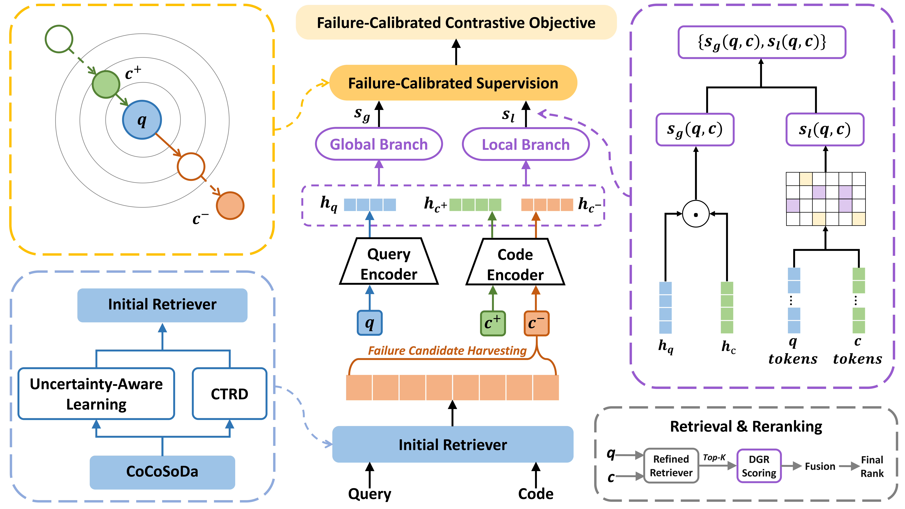

# ReFCode: Failure-Calibrated Dual-Granularity Refinement for Code Search

This repository contains the implementation of **ReFCode**, a failure-calibrated dual-granularity refinement framework for code search.

ReFCode follows a compact three-step pipeline:

1. **Initial Retriever**: train or load a strong dual-encoder retriever and generate top-ranked candidates.
2. **Failure Harvesting**: mine model-induced high-ranked non-ground-truth candidates from the initial retrieval results.
3. **ReFCode Refinement and Final Reranking**: train the refinement model and rerank top candidates by combining global and local matching scores.

## Framework



## Environment

Create the environment with Conda:

```bash
conda env create -f environment.yml
conda activate refcode
```

Alternatively, install dependencies with pip:

```bash
pip install -r requirements.txt
```

## Dataset

The experiments use the **CodeSearchNet** benchmark, a widely used natural language code search dataset containing query-code pairs from six programming languages.

The expected dataset layout is:

```text
dataset/
├── ruby/
├── javascript/
├── java/
├── go/
├── php/
└── python/
```

Full datasets are not included in this repository. Place the processed data under the corresponding language directory or configure dataset paths in `configs/*.yaml`.

### CodeSearchNet Statistics

| Language | Train | Valid | Test |
|---|---:|---:|---:|
| Ruby | 24,927 | 1,400 | 1,261 |
| JavaScript | 58,025 | 3,885 | 3,291 |
| Go | 167,288 | 7,325 | 8,122 |
| Python | 251,820 | 13,914 | 14,918 |
| Java | 164,923 | 5,183 | 10,955 |
| PHP | 241,241 | 12,982 | 14,014 |

## Running the Pipeline

Run the following commands from the repository root.

### 1. Initial Retriever

```bash
bash run_initial_retriever.sh --lang javascript
```

This step trains or loads the initial retriever and generates top-ranked retrieval results.

### 2. Failure Harvesting

```bash
bash run_failure_harvesting.sh --lang javascript
```

This step mines failure candidates from the initial retrieval results.

### 3. ReFCode Refinement and Final Reranking

```bash
bash run_refcode.sh --lang javascript
```

This step trains the ReFCode refinement model and performs final reranking/evaluation.

The language argument can be replaced with:

```text
ruby, javascript, java, go, php, python
```

## Configuration

The main configuration files are:

```text
configs/
├── retriever.yaml     # Initial retriever settings
├── harvesting.yaml    # Failure candidate harvesting settings
└── refcode.yaml       # ReFCode refinement and reranking settings
```

Dataset paths, output paths, and training settings can be adjusted in these files.

## Results

### Overall MRR on CodeSearchNet (%)

| Method | Java | JavaScript | Ruby | Python | PHP | Go | Avg. |
|---|---:|---:|---:|---:|---:|---:|---:|
| CodeBERT | 67.6 | 62.0 | 67.9 | 67.2 | 62.8 | 88.2 | 69.3 |
| GraphCodeBERT | 69.1 | 64.4 | 70.3 | 69.2 | 64.9 | 89.7 | 71.3 |
| UniXcoder | 72.6 | 68.4 | 74.0 | 72.0 | 67.6 | 91.5 | 74.4 |
| SynCoBERT | 72.3 | 67.7 | 72.2 | 72.4 | 67.8 | 91.3 | 74.0 |
| CodeRetriever | 76.5 | 71.9 | 77.1 | 75.8 | 70.8 | 92.4 | 77.4 |
| CoCoSoDa | 76.3 | 76.4 | 81.8 | 75.7 | 70.3 | 92.1 | 78.8 |
| UA-HN | 77.2 | 77.7 | 82.2 | 77.2 | 71.9 | 92.4 | 79.8 |
| HedgeCode | 78.5 | 77.1 | 82.5 | 77.6 | 73.8 | 92.7 | 80.3 |
| **ReFCode** | **78.6** | **79.4** | **83.6** | **78.5** | **73.5** | **93.3** | **81.2** |

### Average Recall@K (%)

| Method | R@1 | R@5 | R@10 |
|---|---:|---:|---:|
| CoCoSoDa | 69.0 | 89.8 | 93.8 |
| UA-HN | 70.7 | 91.3 | 95.1 |
| **ReFCode** | **72.8** | **91.6** | **95.2** |

## Outputs

Generated retrieval results, harvested candidates, checkpoints, reranked outputs, and metric files are saved under `saved_models/` or the output paths specified in `configs/*.yaml`.

The `dataset/` and `saved_models/` directories provide the expected layout only. Large datasets, checkpoints, logs, and generated outputs are ignored by Git.

## Notes

This repository provides the code, configuration files, and placeholder directory structure needed to reproduce the ReFCode pipeline. To reproduce the main results, prepare the processed CodeSearchNet data, configure the paths in `configs/*.yaml`, and run the three pipeline commands in order.
